# vue3.0 diff算法

标签（空格分隔）： vue

---
#### diff痛点
vue2.x中的虚拟dom是进行「全量的对比」，在运行时会对所有节点生成一个虚拟节点树，当页面数据发生变更好，会遍历判断virtual dom所有节点（包括一些不会变化的节点）有没有发生变化；虽然说diff算法确实减少了多DOM节点的直接操作，但是这个「减少是有成本的」，如果是复杂的大型项目，必然存在很复杂的父子关系的VNode,「而Vue2.x的diff算法，会不断地递归调用 patchVNode，不断堆叠而成的几毫秒，最终就会造成 VNode 更新缓慢」。

那么Vue3.0是如何解决这些问题的呢？

vue3在diff算法中相比vue2增加了静态标记

关于这个静态标记，其作用是为了会发生变化的地方添加一个flag标记，下次发生变化的时候直接找该地方进行比较

下图这里，已经标记静态节点的p标签在diff过程中则不会比较，把性能进一步提高
![此处输入图片的描述][1]

这里介绍一个小工具：https://vue-next-template-explorer.netlify.app/

关于静态类型枚举如下
```
export const enum PatchFlags {
  TEXT = 1,// 动态的文本节点
  CLASS = 1 << 1,  // 2 动态的 class
  STYLE = 1 << 2,  // 4 动态的 style
  PROPS = 1 << 3,  // 8 动态属性，不包括类名和样式
  FULL_PROPS = 1 << 4,  // 16 动态 key，当 key 变化时需要完整的 diff 算法做比较
  HYDRATE_EVENTS = 1 << 5,  // 32 表示带有事件监听器的节点
  STABLE_FRAGMENT = 1 << 6,   // 64 一个不会改变子节点顺序的 Fragment
  KEYED_FRAGMENT = 1 << 7, // 128 带有 key 属性的 Fragment
  UNKEYED_FRAGMENT = 1 << 8, // 256 子节点没有 key 的 Fragment
  NEED_PATCH = 1 << 9,   // 512
  DYNAMIC_SLOTS = 1 << 10,  // 动态 solt
  HOISTED = -1,  // 特殊标志是负整数表示永远不会用作 diff
  BAIL = -2 // 一个特殊的标志，指代差异算法
}
```
## 静态提升
「 Vue3.0对于不参与更新的元素，做静态标记并提示，只会被创建一次，在渲染时直接复用。」

这样就免去了重复的创建节点，大型应用会受益于这个改动，免去了重复的创建操作，优化了运行时候的内存占用

```
<div>
  <span>Hello World</span>
  <span >{{msg}}</span>
</div>
```
没有做静态提升之前

```
export function render(_ctx, _cache, $props, $setup, $data, $options) {
  return (_openBlock(), _createElementBlock("div", null, [
    _createElementVNode("span", null, "Hello World"),
    _createElementVNode("span", null, _toDisplayString(_ctx.msg), 1 /* TEXT */)
  ]))
}
```
做了静态提升之后

```
const _hoisted_1 = /*#__PURE__*/_createElementVNode("span", null, "Hello World", -1 /* HOISTED */)

export function render(_ctx, _cache, $props, $setup, $data, $options) {
  return (_openBlock(), _createElementBlock("div", null, [
    _hoisted_1,
    _createElementVNode("span", null, _toDisplayString(_ctx.msg), 1 /* TEXT */)
  ]))
}
```

静态内容_hoisted_1被放置在render 函数外，每次渲染的时候只要取 _hoisted_1 即可

同时 _hoisted_1 被打上了 PatchFlag ，静态标记值为 -1 ，特殊标志是负整数表示永远不会用于 Diff

## 事件监听缓存
默认情况下绑定事件行为会被视为动态绑定，所以每次都会去追踪它的变化

```
<div>
  <button @click = 'onClick'>点我</button>
</div>
```
没开启事件监听器缓存

```
export const render = /*#__PURE__*/_withId(function render(_ctx, _cache, $props, $setup, $data, $options) {
  return (_openBlock(), _createBlock("div", null, [
    _createVNode("button", { onClick: _ctx.onClick }, "点我", 8 /* PROPS */, ["onClick"])
// PROPS=1<<3,// 8 //动态属性，但不包含类名和样式
  ]))
})
```
开启事件侦听器缓存后

```
export function render(_ctx, _cache, $props, $setup, $data, $options) {
  return (_openBlock(), _createBlock("div", null, [
    _createVNode("button", {
      onClick: _cache[1] || (_cache[1] = (...args) => (_ctx.onClick(...args)))
    }, "点我")
  ]))
}
```
上述发现开启了缓存后，没有了静态标记。也就是说下次diff算法的时候直接使用

## SSR优化
当静态内容大到一定量级时候，会用createStaticVNode方法在客户端去生成一个static node，这些静态node，会被直接innerHtml，就不需要创建对象，然后根据对象渲染

```
div>
	<div>
		<span>你好</span>
	</div>
	...  // 很多个静态属性
	<div>
		<span>{{ message }}</span>
	</div>
</div>
```
编译后

```
import { mergeProps as _mergeProps } from "vue"
import { ssrRenderAttrs as _ssrRenderAttrs, ssrInterpolate as _ssrInterpolate } from "@vue/server-renderer"

export function ssrRender(_ctx, _push, _parent, _attrs, $props, $setup, $data, $options) {
  const _cssVars = { style: { color: _ctx.color }}
  _push(`<div${
    _ssrRenderAttrs(_mergeProps(_attrs, _cssVars))
  }><div><span>你好</span>...<div><span>你好</span><div><span>${
    _ssrInterpolate(_ctx.message)
  }</span></div></div>`)
}
```

## vue3 diff算法解析

> vue2 核心 diff 算法 采用的是双端比较算法
> 
> vue3 核心 diff 算法采用的是去头尾的最长递增子序列算法

源码地址：https://github.com/vuejs/core/blob/main/packages/runtime-core/src/renderer.ts

## 1.0 diff无key子节点
在处理被标记为`UNKEYED_FRAGMENT`时。

- 首先会通过新旧子序列获取最小共同长度`commonLength`。

- 对公共部分循环遍历`patch`。

- `patch` 结束，再处理剩余的新旧节点。

- 如果`oldLength > newLength`，说明需要对旧节点进行`unmount`

- 否则，说明有新增节点，需要进行`mount`;

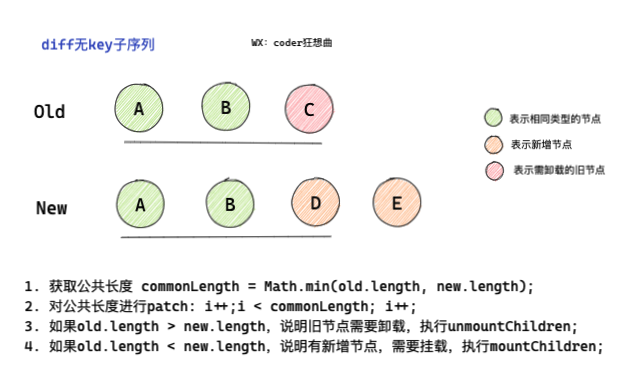

这里贴下省略后的代码。

```javascript
const patchUnkeyedChildren = (c1, c2,...res) => {
    c1 = c1 || EMPTY_ARR
    c2 = c2 || EMPTY_ARR
    // 获取新旧子节点的长度
    const oldLength = c1.length
    const newLength = c2.length
    // 1. 取得公共长度。最小长度
    const commonLength = Math.min(oldLength, newLength)
    let i
    // 2. patch公共部分
    for (i = 0; i < commonLength; i++) { 
      patch(...)
    }
    // 3. 卸载旧节点
    if (oldLength > newLength) {
      // remove old
      unmountChildren(...)
    } else {
      // mount new
      // 4. 否则挂载新的子节点
      mountChildren(...)
    }
  }
```

从上面的代码可以看出，在处理无`key`子节点的时候，逻辑还是非常简单粗暴的。准确的说处理无`key`子节点的效率并不高。

因为不管是直接对公共部分`patch`，还是直接对新增节点进行`mountChildren`（其实是遍历子节点，进行`patch`操作），其实都是在递归进行`patch`，这就会影响到性能。

## 2.0 diff有key子节点序列
在`diff`有`key`子序列的时候，会进行细分处理。主要会经过以下一种情况的判断：

- 起始位置节点类型相同。
- 结束位置节点类型相同。
- 相同部分处理完，有新增节点。
- 相同部分处理完，有旧节点需要卸载。
- 首尾相同，但中间部分存在可复用乱序节点。

在开始阶段，会先生面三个指正，分别是:

`i = 0`，指向新旧序列的开始位置
`e1 = oldLength - 1`，指向旧序列的结束位置
`e2 = newLength - 1`，指向新序列的结束位置
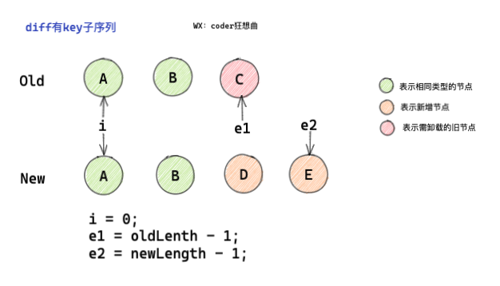

```javascript
let i = 0
const l2 = c2.length
let e1 = c1.length - 1 // prev ending index
let e2 = l2 - 1 // next ending index
```
下面开始分情况进行diff处理。

### 2.1 起始位置节点类型相同
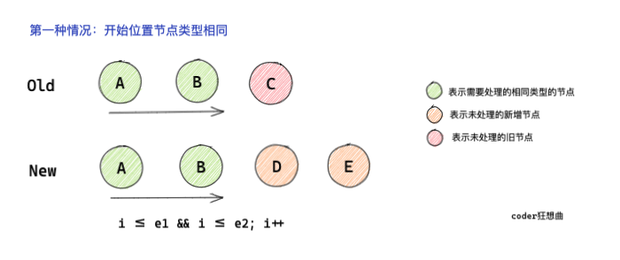

- 对于起始位置类型相同的节点，从左向右进行`diff`遍历。

- 如果新旧节点类型相同，则进行`patch`处理

- 节点类型不同，则`break`，跳出遍历`diff`

```javascript
//  i <= 2 && i <= 3
while (i <= e1 && i <= e2) {
  const n1 = c1[i]
  const n2 = c2[i]
  if (isSameVNodeType(n1, n2)) {
    // 如果是相同的节点类型，则进行递归patch
    patch(...)
  } else {
    // 否则退出
    break
  }
  i++
}
```

上面上略了部分代码，但不影响主要逻辑。

从代码可以知道，遍历时，利用前面在函数全局上下文中声明的三个指针，进行遍历判断。

保证能充分遍历到开始位置相同的位置，`i <= e1 && i <= e2 `。

一旦遇到类型不同的节点，就会跳出`diff`遍历。

### 2.2 结束位置节点类型相同
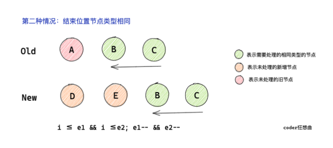

开始位置相同`diff`结束，会紧接着从序列尾部开始遍历`diff`。

此时需要对尾指针`e1`、`e2`进行递减。

```javascript
//  i <= 2 && i <= 3
// 结束后： e1 = 0 e2 =  1
while (i <= e1 && i <= e2) {
  const n1 = c1[e1]
  const n2 = c2[e2]
  if (isSameVNodeType(n1, n2)) {
    // 相同的节点类型
    patch(...)
  } else {
    // 否则退出
    break
  }
  e1--
  e2--
}
```
从代码可以看出，`diff`逻辑与第一种基本一样，相同类型进行`patch`处理。

不同类型`break`，跳出循环遍历。

并且对尾指针进行递减操作。

### 2.3 相同部分遍历结束，新序列中有新增节点，进行挂载
经过上面两种情况的处理，已经`patch`完首尾相同部分的节点，接下来是对新序列中的新增节点进行`patch`处理。

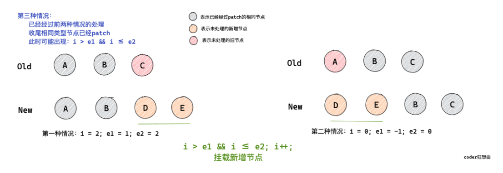

在经过上面两种请款处理之后，如果有新增节点，可能会出现 `i > e1 && i <= e2`的情况。

这种情况下意味着新的子节点序列中有新增节点。

这时会对新增节点进行`patch`。

```javascript
// 3. common sequence + mount
// (a b)
// (a b) c
// i = 2, e1 = 1, e2 = 2
// (a b)
// c (a b)
// i = 0, e1 = -1, e2 = 0
if (i > e1) {
  if (i <= e2) {
    const nextPos = e2 + 1
    // nextPos < l2，说明有已经patch过尾部节点，
    // 否则会获取父节点作为锚点
    const anchor = nextPos < l2 ? c2[nextPos].el : parentAnchor
    while (i <= e2) {
      patch(null, c2[i], anchor, ...others)
      i++
    }
  }
}
```
从上面的代码可以知道，`patch`的时候没有传第一个参数，最终会走`mount`的逻辑。


在`patch`的过程中，会递增i指针。

并通过`nextPos`来获取锚点。

如果`nextPos < l2`，则以已经`patch`的节点作为锚点，否则以父节点作为锚点。

### 2.4 相同部分遍历结束，新序列中少节点，进行卸载
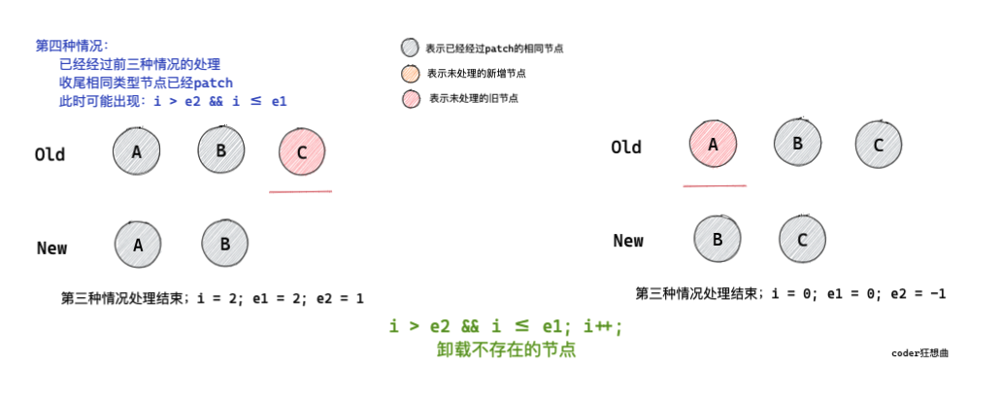

如果处理完收尾相同的节点，出现`i > e2 && i <= e1`的情况，则意味着有旧节点需要进行卸载操作。

```javascript
// 4. common sequence + unmount
// (a b) c
// (a b)
// i = 2, e1 = 2, e2 = 1
// a (b c)
// (b c)
// i = 0, e1 = 0, e2 = -1
// 公共序列 卸载旧的
else if (i > e2) {
  while (i <= e1) {
    unmount(c1[i], parentComponent, parentSuspense, true)
    i++
  }
}
```

通过代码可以知道，这种情况下，会递增i指针，对旧节点进行卸载。

### 2.5 乱序情况
这种情况下较为复杂，但`diff`的核心逻辑在于通过新旧节点的位置变化构建一个最大递增子序列，最大子序列能保证通过最小的移动或者`patch`实现节点的复用。

下面一起来看下如何实现的。
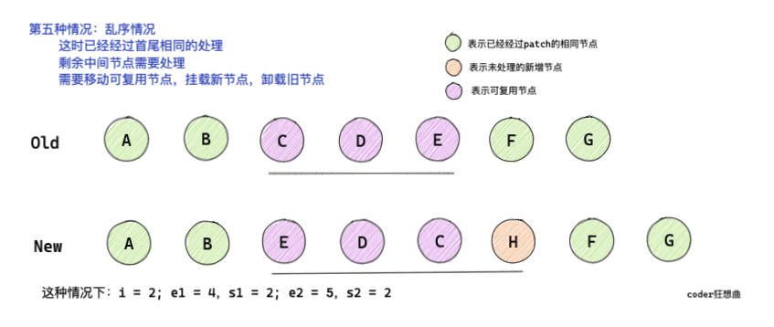


#### 2.5.1 为新子节点构建key:index映射


```javascript
// 5. 乱序的情况
// [i ... e1 + 1]: a b [c d e] f g
// [i ... e2 + 1]: a b [e d c h] f g
// i = 2, e1 = 4, e2 = 5

const s1 = i // s1 = 2
const s2 = i // s2 = 2

// 5.1 build key:index map for newChildren
// 首先为新的子节点构建在新的子序列中 key：index 的映射
// 通过map 创建的新的子节点
const keyToNewIndexMap = new Map()
// 遍历新的节点，为新节点设置key
// i = 2; i <= 5
for (i = s2; i <= e2; i++) {
  // 获取的是新序列中的子节点
  const nextChild = c2[i];
  if (nextChild.key != null) {
    // nextChild.key 已存在
    // a b [e d c h] f g
    // e:2 d:3 c:4 h:5
    keyToNewIndexMap.set(nextChild.key, i)
  }
}
```
结合上面的图和代码可以知道：

在经过首尾相同的patch处理之后，`i = 2，e1 = 4，e2 = 5`

经过遍历之后`keyToNewIndexMap`中，新节点的`key:index`的关系为 `E : 2、D : 3 、C : 4、H : 5`

`keyToNewIndexMap`的作用主要是后面通过遍历旧子序列，确定可复用节点在新的子序列中的位置

#### 2.5.2 从左向右遍历旧子序列，patch匹配的相同类型的节点，移除不存在的节点
经过前面的处理，已经创建了`keyToNewIndexMap`。

在开始从左向右遍历之前，需要知道几个变量的含义：
```javascript
// 5.2 loop through old children left to be patched and try to patch
// matching nodes & remove nodes that are no longer present
// 从旧的子节点的左侧开始循环遍历进行patch。
// 并且patch匹配的节点 并移除不存在的节点

// 已经patch的节点个数
let patched = 0
// 需要patch的节点数量
// 以上图为例：e2 = 5; s2 = 2; 知道需要patch的节点个数
// toBePatched = 4
const toBePatched = e2 - s2 + 1
// 用于判断节点是否需要移动
// 当新旧队列中出现可复用节点交叉时，moved = true
let moved = false
// used to track whether any node has moved
// 用于记录节点是否已经移动
let maxNewIndexSoFar = 0

// works as Map<newIndex, oldIndex>
// 作新旧节点的下标映射
// Note that oldIndex is offset by +1
// 注意 旧节点的 index 要向右偏移一个下标

// and oldIndex = 0 is a special value indicating the new node has
// no corresponding old node.
// 并且旧节点Index = 0 是一个特殊的值，用于表示新的节点中没有对应的旧节点

// used for determining longest stable subsequence
// newIndexToOldIndexMap 用于确定最长递增子序列
// 新下标与旧下标的map
const newIndexToOldIndexMap = new Array(toBePatched)
// 将所有的值初始化为0
// [0, 0, 0, 0]
for (i = 0; i < toBePatched; i++) newIndexToOldIndexMap[i] = 0
```

- 变量 `patched` 用于记录已经`patch`的节点
- 变量 `toBePatched` 用于记录需要进行`patch`的节点个数
- 变量 `moved` 用于记录是否有可复用节点发生交叉
- `maxNewIndexSoFar`用于记录当旧的子序列中存在没有设置`key`的子节点，但是该子节点出现于新的子序列中，且可复用，最大下标。
- 变量`newIndexToOldIndexMap`用于映射「新的子序列中的节点下标」 对应于 「旧的子序列中的节点的下标」
- 并且会将`newIndexToOldIndexMap`初始化为一个全0数组，[0, 0, 0, 0]


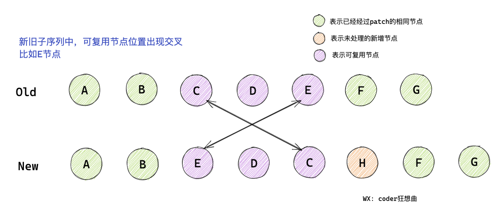

知道了这些变量的含义之后 我们就可以开始从左向右遍历子序列了。

遍历的时候，需要首先遍历旧子序列，起点是`s1`，终点是`e1`。

遍历的过程中会对`patched`进行累加。

### 卸载旧节点
如果`patched >= toBePatched`，说明新子序列中的子节点少于旧子序列中的节点数量。

需要对旧子节点进行卸载。

```javascript
// 遍历未处理旧序列中子节点
for (i = s1; i <= e1; i++) {
    // 获取旧节点
    // 会逐个获取 c d e
    const prevChild = c1[i]
    // 如果已经patch 的数量 >= 需要进行patch的节点个数
    
    // patched刚开始为 0
    // patched >= 4
    if (patched >= toBePatched) {
      // all new children have been patched so this can only be a removal
      // 这说明所有的新节点已经被patch 因此可以移除旧的
      unmount(prevChild, parentComponent, parentSuspense, true)
      continue
    }
}
```
如果`prevChild.key`是存在的，会通过前面我们构建的`keyToNewIndexMap`，获取`prevChild`在新子序列中的下标`newIndex`。

### 获取newIndex
```javascript
// 新节点下标
let newIndex
if (prevChild.key != null) {
  // 旧的节点肯定有key, 
  // 根据旧节点key  获取相同类型的新的子节点  在 新的队列中对应节点位置
  // 这个时候 因为c d e 是原来的节点 并且有key
  // h 是新增节点 旧节点中没有 获取不到 对应的index 会走else
  // 所以newIndex在开始时会有如下情况
  /**
   * node  newIndex
   *  c       4
   *  d       3
   *  e       2
   * */ 
  // 这里是可以获取到newIndex的
  newIndex = keyToNewIndexMap.get(prevChild.key)
}
```
以图为例，可以知道，在遍历过程中，节点`c、d、e`为可复用节点，分别对应新子序列中的`2、3、4`的位置。

故newIndex可以取到的值为`4、3、2`。

如果旧节点没有`key`怎么办？

```javascript
// key-less node, try to locate a key-less node of the same type
// 如果旧的节点没有key
// 则会查找没有key的 且为相同类型的新节点在 新节点队列中 的位置
// j = 2: j <= 5
for (j = s2; j <= e2; j++) {
  if (
    newIndexToOldIndexMap[j - s2] === 0 &&
    // 判断是否是新旧节点是否相同
    isSameVNodeType(prevChild, c2[j])
  ) {
    // 获取到相同类型节点的下标
    newIndex = j
    break
  }
}
```
如果节点没有`key`，则同样会取新子序列中，遍历查找没有`key`且两个新旧类型相同子节点，并以此节点的下标，作为`newIndex`。

> newIndexToOldIndexMap[j - s2] === 0 说明节点没有该节点没有key。

如果还没有获取到`newIndex`，说明在新子序列中没有存在的与 `prevChild` 相同的子节点，需要对`prevChild`进行卸载。

```javascript
if (newIndex === undefined) {
  // 没有对应的新节点 卸载旧的
  unmount(prevChild, parentComponent, parentSuspense, true)
}
```
否则，开始根据`newIndex`，构建`keyToNewIndexMap`，明确新旧节点对应的下标位置。
> 时刻牢记`newIndex`是根据旧节点获取的其在新的子序列中的下标。

```javascript
// 这里处理获取到newIndex的情况
// 开始整理新节点下标 Index 对于 相同类型旧节点在 旧队列中的映射
// 新节点下标从 s2=2 开始，对应的旧节点下标需要偏移一个下标
// 0 表示当前节点没有对应的旧节点
// 偏移 1个位置 i从 s1 = 2 开始，s2 = 2
// 4 - 2 获取下标 2，新的 c 节点对应旧 c 节点的位置下标 3
// 3 - 2 获取下标 1，新的 d 节点对应旧 d 节点的位置下标 4
// 2 - 2 获取下标 0，新的 e 节点对应旧 e 节点的位置下标 5
// [0, 0, 0, 0] => [5, 4, 3, 0]
// [2,3,4,5] = [5, 4, 3, 0]
newIndexToOldIndexMap[newIndex - s2] = i + 1
// newIndex 会取 4 3 2
/** 
 *   newIndex  maxNewIndexSoFar   moved
 *       4            0          false
 *       3            4           true
 *       2        
 * 
 * */ 
if (newIndex >= maxNewIndexSoFar) {
  maxNewIndexSoFar = newIndex
} else {
  moved = true
}
```


在构建`newIndexToOldIndexMap`的同时，会通过判断`newIndex`、`maxNewIndexSoFa`的关系，确定节点是否发生移动。

`newIndexToOldIndexMap`最后遍历结束应该为`[5, 4, 3, 0]`，0说明有旧序列中没有与心序列中对应的节点，并且该节点可能是新增节点。

如果新旧节点在序列中相对位置保持始终不变，则`maxNewIndexSoFar`会随着`newIndex`的递增而递增。

意味着节点没有发生交叉。也就不需要移动可复用节点。

否则可复用节点发生了移动，需要对可复用节点进行`move`。

遍历的最后，会对新旧节点进行`patch`，并对`patched`进行累加，记录已经处理过几个节点。

```javascript
// 进行递归patch
/**
 * old   new
 *  c     c
 *  d     d
 *  e     e 
*/
patch(
  prevChild,
  c2[newIndex],
  container,
  null,
  parentComponent,
  parentSuspense,
  isSVG,
  slotScopeIds,
  optimized
)
// 已经patch的
patched++
```


经过上面的处理，已经完成对旧节点进行了卸载，对相对位置保持没有变化的子节点进行了`patch`复用。

接下来就是需要移动可复用节点，挂载新子序列中新增节点。

#### 2.5.3 移动可复用节点，挂载新增节点
这里涉及到一块比较核心的代码，也是Vue3 diff效率提升的关键所在。

前面通过`newIndexToOldIndexMap`，记录了新旧子节点变化前后的下标映射。

这里会通过`getSequence`方法获取一个最大递增子序列。用于记录相对位置没有发生变化的子节点的下标。

根据此递增子序列，可以实现在移动可复用节点的时候，只移动相对位置前后发生变化的子节点。

做到最小改动。

### 那什么是最大递增子序列？
- 子序列是由数组派生而来的序列，删除（或不删除）数组中的元素而不改变其余元素的顺序。
- 而递增子序列，是数组派生的子序列，各元素之间保持逐个递增的关系。
  例如：
- 数组`[3, 6, 2, 7]` 是数组 `[0, 3, 1, 6, 2, 2, 7]` 的最长严格递增子序列。
- 数组`[2, 3, 7, 101]` 是数组` [10 , 9, 2, 5, 3, 7, 101, 18]`的最大递增子序列。
- 数组`[0, 1, 2, 3] `是数组 `[0, 1, 0, 3, 2, 3]`的最大递增子序列。

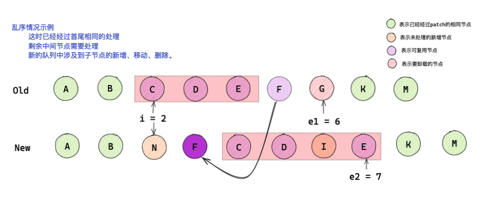


已上图为例，在未处理的乱序节点中，存在新增节点`N、I`、需要卸载的节点`G`，及可复用节点`C、D、E、F`。

节点`C、D、E`在新旧子序列中相对位置没有变换，如果想要通过最小变动实现节点复用，我们可以将找出`F`节点变化前后的下标位置，在新的子序列`C`节点之前插入`F`节点即可。

最大递增子序列的作用就是通过新旧节点变化前后的映射，创建一个递增数组，这样就可以知道哪些节点在变化前后相对位置没有发生变化，哪些节点需要进行移动。

Vue3中的递增子序列的不同在于，它保存的是可复用节点在 `newIndexToOldIndexMap`的下标。而并不是`newIndexToOldIndexMap`中的元素。

接下来我们看下代码部分：
```javascript
// 5.3 move and mount
// generate longest stable subsequence only when nodes have moved
// 移动节点 挂载节点
// 仅当节点被移动后 生成最长递增子序列
// 经过上面操作后，newIndexToOldIndexMap = [5, 4, 3, 0]
// 得到 increasingNewIndexSequence = [2]
const increasingNewIndexSequence = moved
  ? getSequence(newIndexToOldIndexMap)
  : EMPTY_ARR
// j = 0
j = increasingNewIndexSequence.length - 1
// looping backwards so that we can use last patched node as anchor
// 从后向前遍历 以便于可以用最新的被patch的节点作为锚点
// i = 3
for (i = toBePatched - 1; i >= 0; i--) {
  // 5 4 3 2
  const nextIndex = s2 + i
  // 节点 h  c  d  e 
  const nextChild = c2[nextIndex]
  // 获取锚点
  const anchor =
    nextIndex + 1 < l2 ? c2[nextIndex + 1].el : parentAnchor
  // [5, 4, 3, 0] 节点h会被patch，其实是mount
  //  c  d  e 会被移动
  if (newIndexToOldIndexMap[i] === 0) {
    // mount new
    // 挂载新的
    patch(
      null,
      nextChild,
      container,
      anchor,
      ...
    )
  } else if (moved) {
    // move if:
    // There is no stable subsequence (e.g. a reverse)
    // OR current node is not among the stable sequence
    // 如果没有最长递增子序列或者 当前节点不在递增子序列中间
    // 则移动节点
    // 
    if (j < 0 || i !== increasingNewIndexSequence[j]) {
      move(nextChild, container, anchor, MoveType.REORDER)
    } else {
      j--
    }
  }
}
```
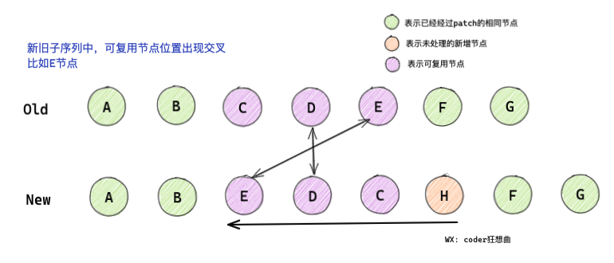


从右向左`patch`节点从上面的代码可以知道：

- 通过`newIndexToOldIndexMap`获取的最大递增子序列是`[2]`
- `j = 0`
- 遍历的时候从右向左遍历，这样可以获取到锚点，如果有已经经过`patch`的兄弟节点，则以兄弟节点作为锚点，否则以父节点作为锚点
- `newIndexToOldIndexMap[i]===0`，说明是新增节点。需要对节点进行`mount`，这时只需给`patch`的第一个参数传`null`即可。可以知道首先会对`h`节点进行`patch`。
- 否则会判断`moved`是否为`true`。通过前面的分析，我们知道节点C & 节点E在前后变化中发生了位置移动。
- 故这里会移动节点，我们知道 「j」 此时为0，「i」 此时为**2**，`i !== increasingNewIndexSequence[j]`为 true，并不会移动`C`节点，而是执行 `j--`。
- 后面因为 `j < 0`，会对 `D、E`节点进行移动。

至此我们就完成了Vue3 diff算法的学习分析。

这里为大家提供了一个示例，可以结合本文的分析过程进行练习：

可以只看第一张图进行分析，分析结束后可以与第二三张图片进行对比。

图一：
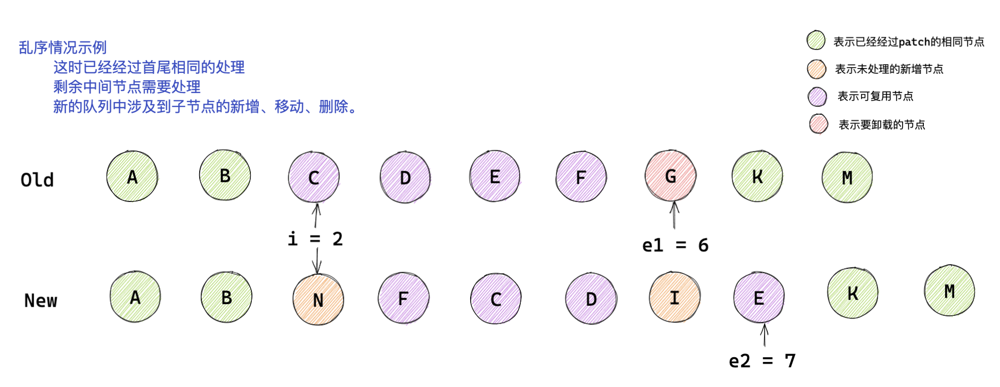

图二 & 三：
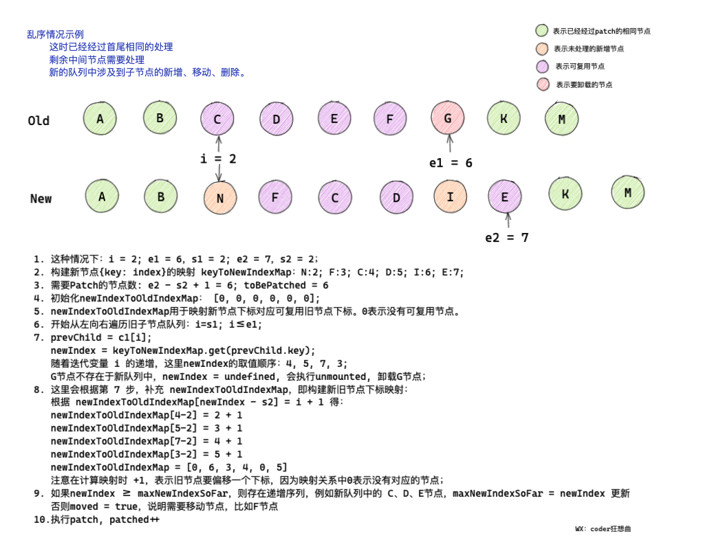
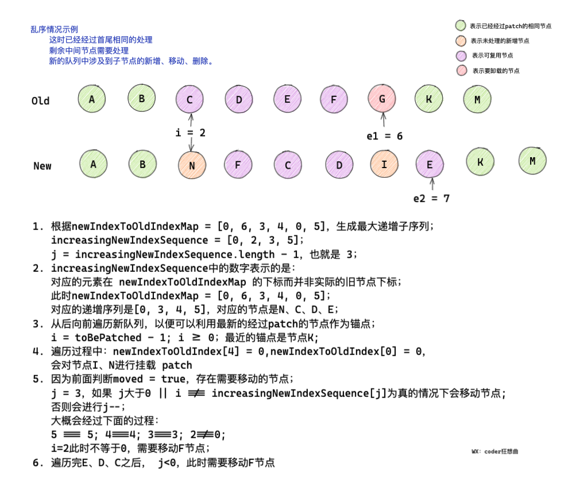


## 总结
通过上面的学习分析，可以知道，Vue3 的diff算法，会首先进行收尾相同节点的`patch`处理，结束后，会挂载新增节点，卸载旧节点。

如果子序列的情况较为复杂，比如出现乱序的情况，则会首先找出可复用的节点，并通过可复用节点的位置映射构建一个最大递增子序列，通过最大递增子序列来对节点进行`mount & move`。以提高`diff`效率，实现节点复用的最大可能性。

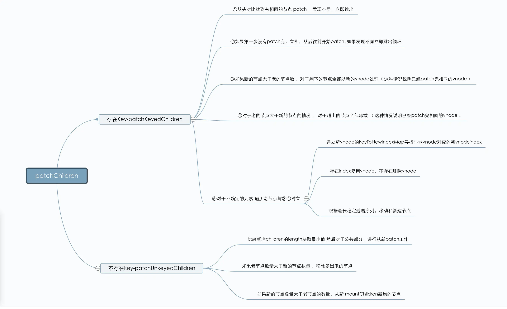


这里分享一个写的比较好的文章：https://www.mdnice.com/writing/7fdcd957224f49d586c73568797b806e


[1]: https://static.vue-js.com/c732e150-5c58-11eb-ab90-d9ae814b240d.png
